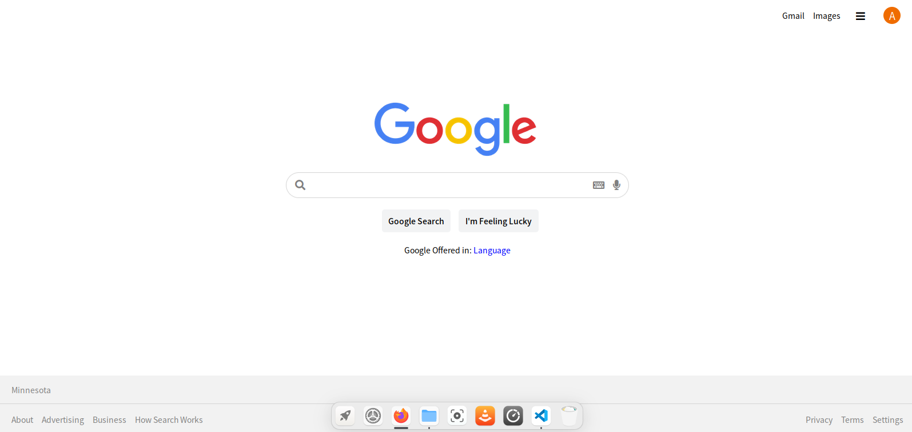
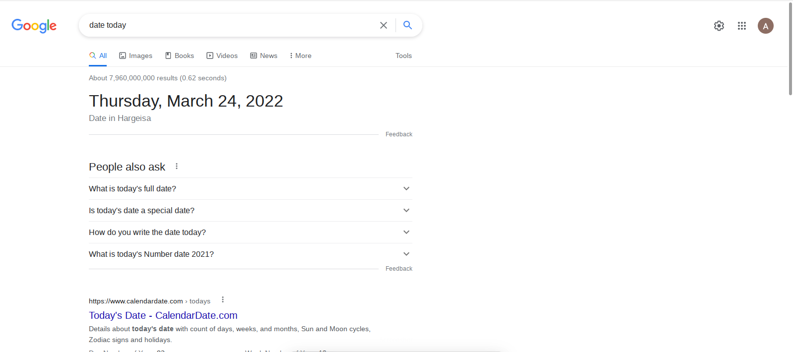

# Google-clone

#  A google clone projects


## Overview
 It  has some of the functionality of google. In which you search and the results will be displayed.

### The challenge
The challenge was to make it look as close to google design wise.
### Screenshot

Before


After


### Links

- Live Site URL: [https://amani-dot.github.io/google-clone/](https://your-live-site-url.com)

## My process

### Built with

- Semantic HTML5 markup
- CSS custom properties
- Flexbox
- CSS Grid
- Mobile-first workflow

### What I learned

I learned how to easily use google search engine as my engine.
 

```js
const searchInput = document.querySelector("#search-input");

searchInput.addEventListener("keydown", function(event) {
    if(event.code === "Enter") {
        search();
    }
});

function search() {
    const input = searchInput.value;

    window.location.href = "https://www.google.com/search?q=" + input + "&rlz=1C5CHFA_enNZ948NZ948&oq=" + input + "&aqs=chrome.0.69i59l2j46i175i199i433j46i199i291i433j46j0i433j0j69i60.875j0j9&sourceid=chrome&ie=UTF-8"
}
}
```


## Author

- Portfolio - [Amani](https://www.your-site.com)
- Twitter - [@Amani-Off](https://www.twitter.com/yourusername)


